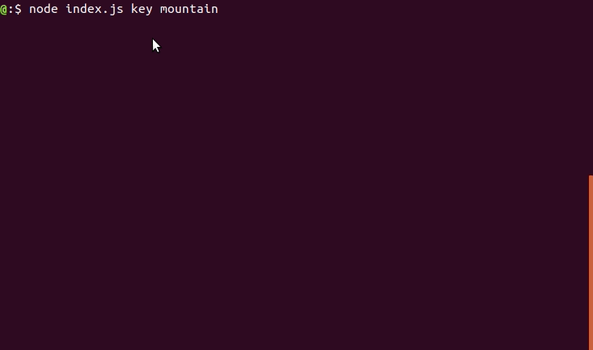

# Waller

> Set the desktop wallpaper from Unsplash API

## Requirements

 - Linux System
 - Generate an API bearer token from [Unsplash](https://unsplash.com/documentation#user-authentication)
 - Node installed

## Getting Started 

1. Clone the directory or download the directory as a zip file<br>

```sh
$ git clone https://github.com/skbro/Waller.git
$ cd Waller
```
2. Install all required Dependencies
```sh
$ npm install
```
3. Go to node_modules/unsplash-js/lib/unsplash.js and add the following line
```js
const fetch = require('node-fetch');
```
4. Run the following command and make sure /usr/bin/gsettings is returned. Go to [askubuntu](https://askubuntu.com/questions/558446/my-dconf-gsettings-installation-is-broken-how-can-i-fix-it-without-ubuntu-reins) in case of any problem.
```sh
$ which gsettings
```
5. Make an empty directory named 'images' to store wallpapers and empty json file named 'config.json' to store tokens and add empty parentheses to file.
```sh
$ mkdir images
$ touch config.json
$ echo "{}" > config.json
```
6. Run the following command to set up unsplash bearer token
```sh
$ node index.js config
```
7. Run index.js with node and explore commands
```sh
$ node index.js key <key_name> # <key_name> can be anything user wants to set as wallpaper e.g. mountain, space, landscape.
```
8. Run following command for any help
```sh
$ node index.js --help
```

## Usage

```
Usage: index [options] [command]

Desktop Wallpaper Utility

Options:
  -V, --version    output the version number
  -h, --help       output usage information

Commands:
  url|u [imgurl]   Add image from url( Wrap in double quotes )
  key|k [keyword]  Get Image with given keyword
  random|r         Set a Random wallpaper
  config           Set Unsplash API token. Visit https://unsplash.com/documentation#user-authentication
```

## Demo



## Problems Faced
 - **Problem**: Anaconda3 package interfered with Gsettings( An API that allows you to access key/value pairs (e.g., persistent application settings) without directly talking to the actual backend that stores that data (config files, gconf, dconf). ).<br/>
 **Solution**: Need to change PATH in .profile file.
 - **Problem**: Unsplash API requires fetch which is a browser API.<br/>
 **Solution**: Used 'node-fetch' and required it in lib folder of unsplash-js.


## Plans

 - [ ] Write Tests

### If user doesn't has Unsplash token
 - [ ] Use backup img.

### When User has token 
 - [ ] Allow user to follow collections and Users.

 ### Features
  - [ ] Allow data uri to be added in url option (look for content type headers)
  - [ ] Add file url
  - [ ] Improve random option
  - [ ] Automate checks for folders and files
  - [ ] Can we get auto startup on network connect?